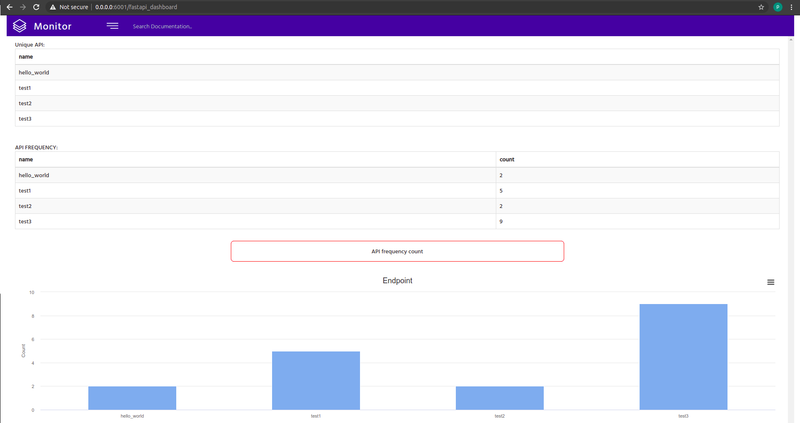

Fastapi Route Log

<!-- <a href="https://pypi.org/project/fastapi-log/" target="_blank"> -->

<!--  -->


A FastAPI router for logging every request.

# Installation

```buildoutcfg
$ pip install fastapi_log
```
# Code Sample
## For Logging
```python
from fastapi_log.log_request import LoggingRoute

app = FastAPI()
app.router.route_class = LoggingRoute
```

# For Accessing Dashboard

```python
from fastapi_log import dashboard
app.include_router(dashboard.router)
```
# Credential for Dashboard
check the url: http://localhost:8000/fastapi_dashboard

Uername : admin 

Password : 12345


# Example/Test

```python
uvicorn example.main:app --reload
```

# Sample Output
## Logging Output

```json
{
    "type": "request",
    "uuid": "e024302b-f11b-4dbb-aadf-46a2ce702411",
    "env": null,
    "region": null,
    "name": null,
    "method": "POST",
    "useragent": {
        "family": "Firefox",
        "major": 88,
        "minor": 0,
        "patch": "88.0",
        "device": {
            "family": "Other",
            "brand": null,
            "model": null,
            "major": "0",
            "minor": "0",
            "patch": "0"
        },
        "os": {
            "family": "Ubuntu",
            "major": 0,
            "minor": 0,
            "patch": ""
        }
    },
    "url": "/test",
    "query": {},
    "body": {
        "name": "Prasanna",
        "userName": "Karthick",
        "age": "NULL",
        "Degree": 0
    },
    "length": null,
    "ts": "2021-05-16 22:50:41"
}
{
    "type": "metrics",
    "uuid": "e024302b-f11b-4dbb-aadf-46a2ce702411",
    "env": null,
    "region": null,
    "name": null,
    "method": "POST",
    "status_code": 200,
    "url": "/test",
    "query": {},
    "length": "65",
    "latency": "0.15",
    "ts": "2021-05-16 22:50:41"
}
INFO:     127.0.0.1:35984 - "POST /test HTTP/1.1" 200 OK
```
## DASHBOARD

# More Features are coming up - Keep waiting 

<a href="https://www.buymeacoffee.com/vpkprasanna" target="_blank"></a>